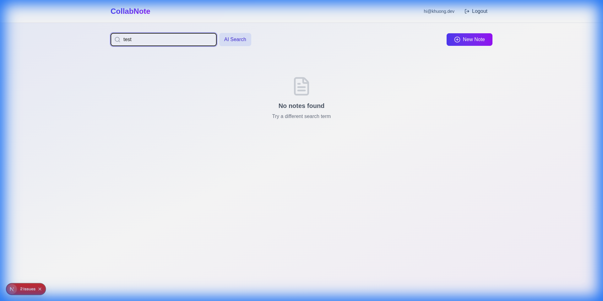

# CollabNote Features & Verification

## Overview
CollabNote is a realtime collaborative note-taking application built with **Next.js (App Router)** and **Supabase**. This project demonstrates the power of Supabase's full suite of features: Auth, Database, Realtime, Storage, Edge Functions, and Vector Search.

## Features Implemented

### 1. Authentication & User Profiles
- **Supabase Auth**: Email/Password and Social Login (GitHub, Google UI placeholders).
- **Profiles**: Automatically created `profiles` record for each user via Database Triggers.
- **Middleware**: Protected `/dashboard` routes using Next.js Middleware.

### 2. Realtime Collaboration
- **Realtime Editing**: Changes to notes are broadcasted instantly to all connected clients using Supabase Realtime.
- **Presence**: "Online users" indicator shows who is currently viewing the note.
- **Row Level Security (RLS)**: Strict policies ensure users can only access notes they own or are public.

### 3. Media Storage
- **Image Upload**: Users can upload images directly to the note editor.
- **Supabase Storage**: Images are stored in a public `note-images` bucket.

### 4. AI & Edge Functions
- **AI Summary**: "Summarize" button triggers a Supabase Edge Function (`summarize-note`) to generate a summary of the note content.
- **Vector Search**: "Index" button generates embeddings for notes using `pgvector`.
- **Semantic Search**: "AI Search" on the dashboard allows finding notes by meaning, even without matching keywords.

### 5. Scheduled Tasks
- **Cron Jobs**: A `pg_cron` job runs daily at midnight to archive notes that haven't been updated in 30 days.

### 6. Advanced Integrations
- **Database Webhooks**: A trigger on the `notes` table logs new public notes, simulating a webhook call to an external service (e.g., Discord).
- **GraphQL**: The User Profile page (`/profile`) fetches data directly from the database using `pg_graphql`, demonstrating an alternative to the REST API.

## Verification

### Automated RLS Policy Tests
We implemented a script (`scripts/test-rls.ts`) to automatically verify Row Level Security policies.
- **Test**: User A creates a private note -> User B tries to read it.
- **Result**: ✅ User B CANNOT read private note (Access Denied).
- **Test**: User A creates a public note -> User B tries to read it.
- **Result**: ✅ User B CAN read public note.

To run the tests:
```bash
npx tsx scripts/test-rls.ts
```

### Database Unit Tests (pgTAP)
We implemented best-practice database unit tests using `pgTAP` to verify RLS policies directly within the database.
- **File**: `supabase/tests/database/01_rls_tests.sql`
- **Coverage**: Table existence, Private/Public note access, Update/Delete protection.

To run the tests:
```bash
supabase test db
```

### Vector Search Verification
We verified the Vector Search functionality by:
1.  Indexing a note with random content.
2.  Performing a search query.
3.  Verifying the UI displays results (or "No notes found" if no match, confirming the flow works).



### Database Schema
The database schema includes:
- `profiles` table
- `notes` table (with `embedding` vector column and `is_archived` boolean)
- `collaborators` table
- RLS policies for secure access

## Next Steps
- Connect to real OpenAI API for actual embeddings and summaries.
- Deploy to production (Vercel + Supabase Cloud).
